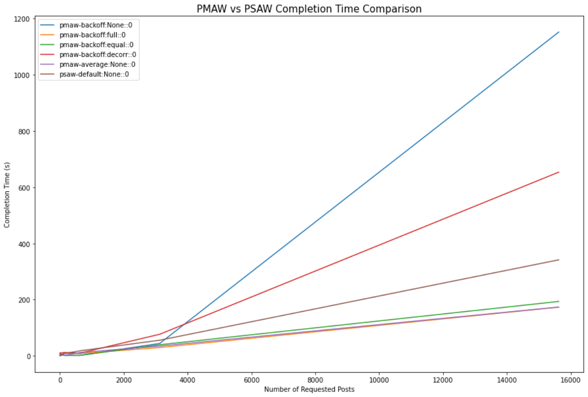
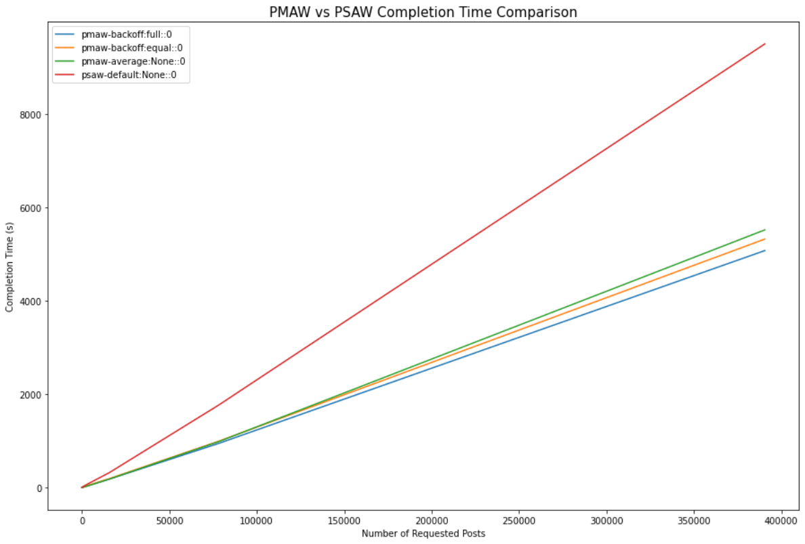
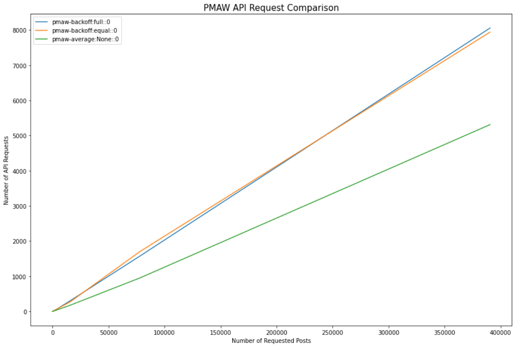

<h2 align="center">PMAW: Pushshift Multithread API Wrapper</h2>

[](https://pypi.org/project/pmaw/)
[](https://www.python.org/)
[](https://opensource.org/licenses/MIT)

# Description

**PMAW** is an ultra minimalist wrapper for the Pushshift API which uses multithreading to retrieve Reddit comments and submissions. General usage is through the `PushshiftAPI` class which provides methods for interacting with different `Pushshift` endpoints, please view the [Pushshift Docs](https://github.com/pushshift/api) for more details on the endpoints and accepted parameters. Parameters are provided through keyword arguments when calling the method, some methods will have required parameters. When using a method **PMAW** will complete all the required API calls to complete the query before returning an array of values, or in the case of `search_submission_comment_ids` a dictionary is returned mapping the submission id to an array of comment ids.

The following three methods are currently supported:

- Searching Comments: `search_comments`
  - [Details](https://github.com/pushshift/api#searching-comments)
- Search Submissions: `search_submissions`
  - [Details](https://github.com/pushshift/api#searching-submissions)
- Search Submission Comment IDs: `search_submission_comment_ids`
  - [Details](https://github.com/pushshift/api#get-all-comment-ids-for-a-particular-submission)

# Getting Started

## Installation

**PMAW** currently supports _Python 3.5_ or later. To install it via _pip_, run:

```sh
$ pip install pmaw
```

### General Usage

```python
from pmaw import PushshiftAPI()
api = PushshiftAPI()
```

View the optional parameters for PushshiftAPI [here](#pushshiftapi).

## Why Multithread?

When building large datasets from Reddit submission and comment data it can require thousands of API calls to the Pushshift API. The time it takes for your code to complete pulling all this data is limited by both your network latency and the response time of the Pushshift server, which can vary throughout the day.

Current API libraries such as PRAW and PSAW currently run requests sequentially, which can cause thousands of API calls to take many hours to complete. Since API requests are I/O-bound they can benefit from being run asynchronously using multiple threads. Implementing intelligent rate limiting can ensure that we minimize the number of rejected requests, and the time it takes to complete.

## Benchmark Comparison

A benchmark comparison was performed to determined the completion time for different size requests, ranging from 1 to 390,000 requested posts. This will allow us to determine which Pushshift wrappers and rate-limiting methods are best for different request sizes.

We also compare the number of total API requests sent by each **PMAW** rate-limit configuration for each request size.

Default parameters were used for each **PMAW** rate-limit configuration as well as the default **PSAW** configuration, which does not provide multiple rate-limit implementations.

### Results



For the first benchmark test we compare the completion times for all possible **PMAW** rate-limiting configurations with **PSAW** for up to 16,000 requested posts. We can see that the three most performant rate-limiting settings for **PMAW** are rate-averaging, and exponential backoff with full or equal jitter.



We ran this second benchmark increasing up to 390,000 requested posts, excluding the least performant **PMAW** rate-limiting configurations. From this benchmark, we can see that **PMAW** was on average 1.79x faster than **PSAW** at 390,625 posts retrieved. The total completion time for 390,625 posts with **PSAW** was 2h38m, while the average completion time was 1h28m for **PMAW**.



We also compare the number of required requests for each of the three **PMAW** rate-limit configurations. From this comparison, we can see that for 390,625 requested posts rate-averaging made 33.60% less API requests than exponential backoff.

[Benchmark Notebook](https://github.com/mattpodolak/pmaw/blob/master/examples/benchmark.ipynb)

# Features

## Rate Limiting

Multiple different options are available for rate-limiting your Pushshift API requests, and are defined by two different types, rate-averaging and exponential backoff. If you're unsure on which to use, refer to the [benchmark comparison](#benchmark-comparison).

### Rate-Averaging

**PMAW** by default rate limits using rate-averaging so that the concurrent API requests to the Pushshift server are limited to your provided rate.

Providing a `rate_limit` value is optional, this defaults to `60` requests per minute which is the recommended value for interacting with the Pushshift API. Increasing this value above `60` will increase the number of rejected requests and will increase the burden on the Pushshift server. A maximum recommended value is `100` requests per minute.

Additionally, the rate-limiting behaviour can be constrained by the `max_sleep` parameter which allows you to select a maximum period of time to sleep between requests.

### Exponential Backoff

Exponential backoff can be used by setting the `limit_type` to backoff. Four flavours of `backoff` are available based on the usage of jitter: None, full, equal, and decorr - decorrelated.

Exponential backoff is calculated by multiplying the `base_backoff` by 2 to the power of the number of failed batches. This allows batches to be spaced out, reducing the resulting rate-limit when requests start to be rejected. However, the threads will still be requesting at nearly the same time, increasing the overall number of required API requests. The exponential backoff sleep values are capped by the `max_sleep` parameter.

Introducing an element of randomness called `jitter` allows us to reduce the competition between threads and distribute the API requests across the window, reducing the number of rejected requests.

- `full` jitter selects the length of sleep for a request by randomly sampling from a normal distribution for values between 0 and the capped exponential backoff value.
- `equal` jitter selects the length of sleep for a request by adding half the capped exponential backoff value to a random sample from a normal distribution between 0 and half the capped exponential backoff value.
- `decorr` - decorrelated jitter is similar to `full` jitter but increases the maximum jitter based on the last random value, selecting the length of sleep by the minimum value between `max_sleep` and a random sample between the `base_backoff` and the last sleep value multiplied by 3.

## Multithreading

The number of threads to use during multithreading is set with the `num_workers` parameter. This is optional and defaults to `10`, however, you should provide a value as this may not be appropriate for your machine. Increasing the number of threads you use allows you to make more concurrent requests to Pushshift, however, the returns are diminishing as requests are constrained by the rate-limit. The optimal number of threads for requests is between `10` and `20` depending on the current response time of the Pushshift server.

When selecting the number of `threads` you can follow one of the two methodologies:

- Number of processors on the machine, multiplied by 5
- Minimum value of 32 and the number of processors plus 4

If you are unsure how many processors you have use: `os.cpu_count()`.

## Unsupported

- `asc` sort is unsupported
- `before` and `after` only support epoch time (float or int)
- `aggs` are unsupported, as **PMAW** is intended to be used for collecting large numbers of submissions or comments. Use [PSAW](https://github.com/dmarx/psaw) for aggregation requests.

### Features Requests

- For feature requests please open an issue with the `feature request` label, this will allow features to be better prioritized for future releases

# Parameters

## PushshiftAPI

- `num_workers` (int, optional): Number of workers to use for multithreading, defaults to 10.
- `max_sleep` (int, optional): Maximum rate-limit sleep time (in seconds) between requests, defaults to 60s.
- `rate_limit` (int, optional): Target number of requests per minute for rate-averaging, defaults to 60 requests per minute.
- `base_backoff` (float, optional): Base delay in seconds for exponential backoff, defaults to 0.5s
- `max_ids_per_request` (int, optional): Maximum number of ids to use in a single request, defaults to 1000, maximum 1000.
- `max_results_per_request` (int, optional): Maximum number of items to return in a single non-id based request, defaults to 100, maximum 100.
- `batch_size` (int, optional): Size of batches for multithreading, defaults to number of workers.
- `shards_down_behavior` (str, optional): Specifies how PMAW will respond if some shards are down during a query. Options are 'warn' to only emit a warning, 'stop' to throw a RuntimeError, or None to take no action. Defaults to 'warn'.
- `limit_type` (str, optional): Type of rate limiting to use, options are 'average' for rate averaging, 'backoff' for exponential backoff. Defaults to 'average'.
- `jitter` (str, optional): Jitter to use with backoff, options are None, 'full', 'equal', 'decorr'. Defaults to None.
- `search_window` (int, optional): Size in days for search window for submissions / comments in non-id based search, defaults to 365
- `checkpoint` (int, optional): Size of interval in requests to print a checkpoint with stats, defaults to 100

## `search_submissions` and `search_comments`

- Unlike the Pushshift API, the `before` and `after` must be in epoch time
- `limit` is the number of submissions/comments to return. If set to `None` or if the set `limit` is higher than the number of available submissions/comments for the provided parameters then `limit` will be set to the amount available.
- Other accepted parameters are covered in the Pushshift documentation for [submissions](https://github.com/pushshift/api#searching-submissions) and [comments](https://github.com/pushshift/api#searching-comments).

## `search_submission_comment_ids`

- `ids` is a required parameter and should be an array of submission ids, a single id can be passed as a string
- Other accepted parameters are covered in the Pushshift [documentation](https://github.com/pushshift/api#get-all-comment-ids-for-a-particular-submission)

# Examples

## Comments

### Search Comments

```python
comments = api.search_comments(subreddit="science", limit=1000)
```

### Search Comments by IDs

```python
comment_ids = ['gjacwx5','gjad2l6','gjadatw','gjadc7w','gjadcwh',
  'gjadgd7','gjadlbc','gjadnoc','gjadog1','gjadphb']
comments_arr = api.search_comments(ids=comment_ids)
```

You can supply a single comment by passing the id as a string or an array with a length of 1 to `ids`

[Detailed Example](https://github.com/mattpodolak/pmaw/blob/master/examples/search_comments.ipynb)

### Search Comment IDs by Submission ID

```python
post_ids = ['kxi2w8','kxi2g1','kxhzrl','kxhyh6','kxhwh0',
  'kxhv53','kxhm7b','kxhm3s','kxhg37','kxhak9']
comment_id_dict = api.search_submission_comment_ids(ids=post_ids)
```

You can supply a single submission by passing the id as a string or an array with a length of 1 to `ids`

[Detailed Example](https://github.com/mattpodolak/pmaw/blob/master/examples/search_submission_comment_ids.ipynb)

## Submissions

### Search Submissions

```python
submissions = api.search_submissions(subreddit="science", limit=1000)
```

### Search Submissions by IDs

```python
post_ids = ['kxi2w8','kxi2g1','kxhzrl','kxhyh6','kxhwh0',
  'kxhv53','kxhm7b','kxhm3s','kxhg37','kxhak9']
posts_arr = api.search_submissions(ids=post_ids)
```

You can supply a single submission by passing the id as a string or an array with a length of 1 to `ids`

[Detailed Example](https://github.com/mattpodolak/pmaw/blob/master/examples/search_submissions.ipynb)

## License

**PMAW** is released under the MIT License. See the
[LICENSE](https://github.com/mattpodolak/pmaw/blob/master/LICENSE) file for more
details.
